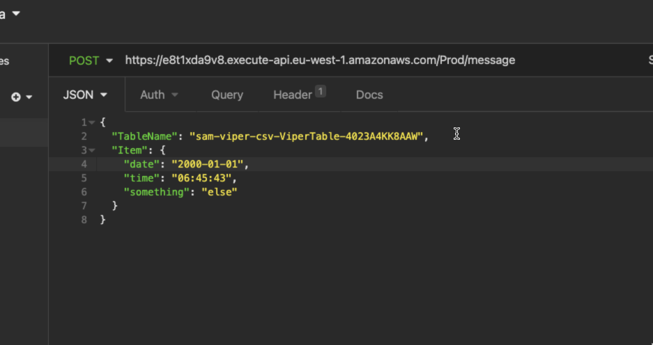

## Steps to go through

1. High level architecture

#### Steps:

```shell
sam validate --template template.yaml


sam build                                                            ░▒▓ 1 ✘  18s  .venv-aws-cart   09:53:06
Building codeuri: /Users/ / /serverless-viperidae/apigtw_dynamo runtime: nodejs12.x metadata: {} functions: ['GetMessagesFunction', 'GetMessageFunction', 'PostMessageFunction', 'PutMessageFunction', 'DeleteMessageFunction']
Running NodejsNpmBuilder:NpmPack
Running NodejsNpmBuilder:CopyNpmrc
Running NodejsNpmBuilder:CopySource
Running NodejsNpmBuilder:NpmInstall
Running NodejsNpmBuilder:CleanUpNpmrc
Building codeuri: /Users/ / /serverless-viperidae runtime: python3.8 metadata: {} functions: ['SqsToDynamoDbFunction', 'S3ToSQSFunction']
Running PythonPipBuilder:ResolveDependencies
Running PythonPipBuilder:CopySource

Build Succeeded

Built Artifacts  : .aws-sam/build
Built Template   : .aws-sam/build/template.yaml

Commands you can use next
=========================
[*] Invoke Function: sam local invoke
[*] Deploy: sam deploy --guided


 ~/e/serverless-viperidae  master !1 ?4 ▓▒░ sam deploy --guided                                                   ░▒▓ ✔  19s  .venv-aws-cart   11:35:27

Configuring SAM deploy
======================

        Looking for config file [samconfig.toml] :  Found
        Reading default arguments  :  Success

        Setting default arguments for 'sam deploy'
        =========================================
        Stack Name [viperCsv]:
        AWS Region [eu-west-1]:
        Parameter DataBucketName [serverless-viperidae-csv]:
        #Shows you resources changes to be deployed and require a 'Y' to initiate deploy
        Confirm changes before deploy [Y/n]: y
        #SAM needs permission to be able to create roles to connect to the resources in your template
        Allow SAM CLI IAM role creation [Y/n]: y
        GetMessagesFunction may not have authorization defined, Is this okay? [y/N]: y
        GetMessageFunction may not have authorization defined, Is this okay? [y/N]: y
        PostMessageFunction may not have authorization defined, Is this okay? [y/N]: y
        PutMessageFunction may not have authorization defined, Is this okay? [y/N]: yy
Error: invalid input
        PutMessageFunction may not have authorization defined, Is this okay? [y/N]: y
        DeleteMessageFunction may not have authorization defined, Is this okay? [y/N]: y
        Save arguments to configuration file [Y/n]: y
        SAM configuration file [samconfig.toml]:
        SAM configuration environment [default]:

        Looking for resources needed for deployment: Found!

                Managed S3 bucket: aws-sam-cli-managed-default-samclisourcebucket-6s0g1nstqs08
                A different default S3 bucket can be set in samconfig.toml

        Saved arguments to config file
        Running 'sam deploy' for future deployments will use the parameters saved above.
        The above parameters can be changed by modifying samconfig.toml
        Learn more about samconfig.toml syntax at
        https://docs.aws.amazon.com/serverless-application-model/latest/developerguide/serverless-sam-cli-config.html

Uploading to viperCsv/842d2637afd23647780f7b454cf51c29  42266285 / 42266285  (100.00%)

        Deploying with following values
        ===============================
        Stack name                   : viperCsv
        Region                       : eu-west-1
        Confirm changeset            : True
        Deployment s3 bucket         : aws-sam-cli-managed-default-samclisourcebucket-6s0g1nstqs08
        Capabilities                 : ["CAPABILITY_IAM"]
        Parameter overrides          : {"DataBucketName": "serverless-viperidae-csv"}
        Signing Profiles             : {}

Initiating deployment
=====================
Uploading to viperCsv/2b52160bd544d0bd2e4528eaa1eb731c.template  8099 / 8099  (100.00%)

Waiting for changeset to be created..

CloudFormation stack changeset
---------------------------------------------------------------------------------------------------------------------------------------------------------
Operation                              LogicalResourceId                      ResourceType                           Replacement
---------------------------------------------------------------------------------------------------------------------------------------------------------
+ Add                                  DeadLetterQueue                        AWS::SQS::Queue                        N/A
+ Add                                  DeleteMessageFunctionRole              AWS::IAM::Role                         N/A
+ Add                                  DeleteMessageFunctiondeleteMessagePe   AWS::Lambda::Permission                N/A
                                       rmissionProd
+ Add                                  DeleteMessageFunction                  AWS::Lambda::Function                  N/A
+ Add                                  GetMessageFunctionRole                 AWS::IAM::Role                         N/A
+ Add                                  GetMessageFunctiongetMessagesPermiss   AWS::Lambda::Permission                N/A
                                       ionProd
+ Add                                  GetMessageFunction                     AWS::Lambda::Function                  N/A
+ Add                                  GetMessagesFunctionRole                AWS::IAM::Role                         N/A
+ Add                                  GetMessagesFunctiongetMessagesPermis   AWS::Lambda::Permission                N/A
                                       sionProd
+ Add                                  GetMessagesFunction                    AWS::Lambda::Function                  N/A
+ Add                                  PostMessageFunctionRole                AWS::IAM::Role                         N/A
+ Add                                  PostMessageFunctionpostMessagePermis   AWS::Lambda::Permission                N/A
                                       sionProd
+ Add                                  PostMessageFunction                    AWS::Lambda::Function                  N/A
+ Add                                  PutMessageFunctionRole                 AWS::IAM::Role                         N/A
+ Add                                  PutMessageFunctionputMessagePermissi   AWS::Lambda::Permission                N/A
                                       onProd
+ Add                                  PutMessageFunction                     AWS::Lambda::Function                  N/A
+ Add                                  S3ToSQSFunctionExecutionRole           AWS::IAM::Role                         N/A
+ Add                                  S3ToSQSFunctionPermission              AWS::Lambda::Permission                N/A
+ Add                                  S3ToSQSFunction                        AWS::Lambda::Function                  N/A
+ Add                                  SqsToDynamoDbFunctionRole              AWS::IAM::Role                         N/A
+ Add                                  SqsToDynamoDbFunctionSqsToDynamoDb     AWS::Lambda::EventSourceMapping        N/A
+ Add                                  SqsToDynamoDbFunction                  AWS::Lambda::Function                  N/A
+ Add                                  ViperApiDeployment4f90ae3d00           AWS::ApiGateway::Deployment            N/A
+ Add                                  ViperApiProdStage                      AWS::ApiGateway::Stage                 N/A
+ Add                                  ViperApi                               AWS::ApiGateway::RestApi               N/A
+ Add                                  ViperDataBucket                        AWS::S3::Bucket                        N/A
+ Add                                  ViperQueue                             AWS::SQS::Queue                        N/A
+ Add                                  ViperTable                             AWS::DynamoDB::Table                   N/A
---------------------------------------------------------------------------------------------------------------------------------------------------------

Changeset created successfully. arn:aws:cloudformation:eu-west-1:838626446375:changeSet/samcli-deploy1621334362/c2065981-103a-4367-971f-675a43b1fcfe


Previewing CloudFormation changeset before deployment
======================================================
Deploy this changeset? [y/N]:
```

But then there's some errors when deploy again

```
Error: Unable to upload artifact GetMessagesFunction referenced by CodeUri parameter of GetMessagesFunction resource.

S3 Bucket does not exist.

```

So have to package first and then deploy. Also, have to create the S3 bucket to hold the deployment package instead of letting SAM create itself.

```shell
sam package --output-template-file packaged.yaml --s3-bucket sam-viper-csv
Uploading to 6e0773b74eb527dd325dfc1f3b502bd4  8503661 / 8503661  (100.00%)
Uploading to f401b28d046773f3574658c9e93447fc  42267477 / 42267477  (100.00%)

Successfully packaged artifacts and wrote output template to file packaged.yaml.
Execute the following command to deploy the packaged template
sam deploy --template-file /Users/ / /serverless-viperidae/packaged.yaml --stack-name <YOUR STACK NAME>

```

Deploy:

```shell
sam deploy --template-file /Users/ / /serverless-viperidae/packaged.yaml --stack-name sam-viper-csv

        Deploying with following values
        ===============================
        Stack name                   : sam-viper-csv
        Region                       : eu-west-1
        Confirm changeset            : True
        Deployment s3 bucket         : sam-viper-csv
        Capabilities                 : ["CAPABILITY_IAM"]
        Parameter overrides          : {"DataBucketName": "serverless-viperidae-csv"}
        Signing Profiles             : {}

Initiating deployment
=====================
Uploading to sam-viper-csv/3a814ef864d595e998dd9316a5ec5ea1.template  7714 / 7714  (100.00%)

Waiting for changeset to be created..

CloudFormation stack changeset
-----------------------------------------------------------------------------------------------------------------------------------------------------
Operation                             LogicalResourceId                     ResourceType                          Replacement
-----------------------------------------------------------------------------------------------------------------------------------------------------
+ Add                                 DeadLetterQueue                       AWS::SQS::Queue                       N/A
+ Add                                 DeleteMessageFunctionRole             AWS::IAM::Role                        N/A
+ Add                                 DeleteMessageFunctiondeleteMessageP   AWS::Lambda::Permission               N/A
                                      ermissionProd
+ Add                                 DeleteMessageFunction                 AWS::Lambda::Function                 N/A
+ Add                                 GetMessageFunctionRole                AWS::IAM::Role                        N/A
+ Add                                 GetMessageFunctiongetMessagesPermis   AWS::Lambda::Permission               N/A
                                      sionProd
+ Add                                 GetMessageFunction                    AWS::Lambda::Function                 N/A
+ Add                                 GetMessagesFunctionRole               AWS::IAM::Role                        N/A
+ Add                                 GetMessagesFunctiongetMessagesPermi   AWS::Lambda::Permission               N/A
                                      ssionProd
+ Add                                 GetMessagesFunction                   AWS::Lambda::Function                 N/A
+ Add                                 PostMessageFunctionRole               AWS::IAM::Role                        N/A
+ Add                                 PostMessageFunctionpostMessagePermi   AWS::Lambda::Permission               N/A
                                      ssionProd
+ Add                                 PostMessageFunction                   AWS::Lambda::Function                 N/A
+ Add                                 PutMessageFunctionRole                AWS::IAM::Role                        N/A
+ Add                                 PutMessageFunctionputMessagePermiss   AWS::Lambda::Permission               N/A
                                      ionProd
+ Add                                 PutMessageFunction                    AWS::Lambda::Function                 N/A
+ Add                                 S3ToSQSFunctionExecutionRole          AWS::IAM::Role                        N/A
+ Add                                 S3ToSQSFunctionPermission             AWS::Lambda::Permission               N/A
+ Add                                 S3ToSQSFunction                       AWS::Lambda::Function                 N/A
+ Add                                 SqsToDynamoDbFunctionRole             AWS::IAM::Role                        N/A
+ Add                                 SqsToDynamoDbFunctionSqsToDynamoDb    AWS::Lambda::EventSourceMapping       N/A
+ Add                                 SqsToDynamoDbFunction                 AWS::Lambda::Function                 N/A
+ Add                                 ViperApiDeployment4f90ae3d00          AWS::ApiGateway::Deployment           N/A
+ Add                                 ViperApiProdStage                     AWS::ApiGateway::Stage                N/A
+ Add                                 ViperApi                              AWS::ApiGateway::RestApi              N/A
+ Add                                 ViperDataBucket                       AWS::S3::Bucket                       N/A
+ Add                                 ViperQueue                            AWS::SQS::Queue                       N/A
+ Add                                 ViperTable                            AWS::DynamoDB::Table                  N/A
-----------------------------------------------------------------------------------------------------------------------------------------------------

Changeset created successfully. arn:aws:cloudformation:eu-west-1:838626446375:changeSet/samcli-deploy1621358150/76a1bbb3-b7a6-45e0-aac4-5d5c19ee6636


Previewing CloudFormation changeset before deployment
======================================================
Deploy this changeset? [y/N]: y

2021-05-18 18:16:08 - Waiting for stack create/update to complete

CloudFormation events from changeset
-----------------------------------------------------------------------------------------------------------------------------------------------------
ResourceStatus                        ResourceType                          LogicalResourceId                     ResourceStatusReason
-----------------------------------------------------------------------------------------------------------------------------------------------------
CREATE_IN_PROGRESS                    AWS::DynamoDB::Table                  ViperTable                            -
CREATE_IN_PROGRESS                    AWS::SQS::Queue                       DeadLetterQueue                       Resource creation Initiated
CREATE_IN_PROGRESS                    AWS::SQS::Queue                       DeadLetterQueue                       -
CREATE_IN_PROGRESS                    AWS::DynamoDB::Table                  ViperTable                            Resource creation Initiated
CREATE_COMPLETE                       AWS::SQS::Queue                       DeadLetterQueue                       -
CREATE_IN_PROGRESS                    AWS::SQS::Queue                       ViperQueue                            -
CREATE_IN_PROGRESS                    AWS::SQS::Queue                       ViperQueue                            Resource creation Initiated
CREATE_COMPLETE                       AWS::SQS::Queue                       ViperQueue                            -
CREATE_IN_PROGRESS                    AWS::IAM::Role                        S3ToSQSFunctionExecutionRole          -
CREATE_IN_PROGRESS                    AWS::IAM::Role                        S3ToSQSFunctionExecutionRole          Resource creation Initiated
CREATE_COMPLETE                       AWS::DynamoDB::Table                  ViperTable                            -
CREATE_IN_PROGRESS                    AWS::IAM::Role                        GetMessagesFunctionRole               -
CREATE_IN_PROGRESS                    AWS::IAM::Role                        SqsToDynamoDbFunctionRole             -
CREATE_IN_PROGRESS                    AWS::IAM::Role                        GetMessageFunctionRole                -
CREATE_IN_PROGRESS                    AWS::IAM::Role                        DeleteMessageFunctionRole             -
CREATE_IN_PROGRESS                    AWS::IAM::Role                        PutMessageFunctionRole                -
CREATE_IN_PROGRESS                    AWS::IAM::Role                        PostMessageFunctionRole               -
CREATE_IN_PROGRESS                    AWS::IAM::Role                        DeleteMessageFunctionRole             Resource creation Initiated
CREATE_IN_PROGRESS                    AWS::IAM::Role                        PostMessageFunctionRole               Resource creation Initiated
CREATE_IN_PROGRESS                    AWS::IAM::Role                        PutMessageFunctionRole                Resource creation Initiated
CREATE_IN_PROGRESS                    AWS::IAM::Role                        SqsToDynamoDbFunctionRole             Resource creation Initiated
CREATE_COMPLETE                       AWS::IAM::Role                        S3ToSQSFunctionExecutionRole          -
CREATE_IN_PROGRESS                    AWS::IAM::Role                        GetMessagesFunctionRole               Resource creation Initiated
CREATE_IN_PROGRESS                    AWS::Lambda::Function                 S3ToSQSFunction                       -
CREATE_IN_PROGRESS                    AWS::IAM::Role                        GetMessageFunctionRole                Resource creation Initiated
CREATE_COMPLETE                       AWS::Lambda::Function                 S3ToSQSFunction                       -
CREATE_IN_PROGRESS                    AWS::Lambda::Function                 S3ToSQSFunction                       Resource creation Initiated
CREATE_IN_PROGRESS                    AWS::Lambda::Permission               S3ToSQSFunctionPermission             Resource creation Initiated
CREATE_IN_PROGRESS                    AWS::Lambda::Permission               S3ToSQSFunctionPermission             -
CREATE_COMPLETE                       AWS::IAM::Role                        PutMessageFunctionRole                -
CREATE_COMPLETE                       AWS::IAM::Role                        DeleteMessageFunctionRole             -
CREATE_COMPLETE                       AWS::IAM::Role                        PostMessageFunctionRole               -
CREATE_COMPLETE                       AWS::Lambda::Permission               S3ToSQSFunctionPermission             -
CREATE_IN_PROGRESS                    AWS::Lambda::Function                 DeleteMessageFunction                 -
CREATE_IN_PROGRESS                    AWS::Lambda::Function                 PostMessageFunction                   -
CREATE_COMPLETE                       AWS::IAM::Role                        GetMessagesFunctionRole               -
CREATE_COMPLETE                       AWS::IAM::Role                        SqsToDynamoDbFunctionRole             -
CREATE_IN_PROGRESS                    AWS::Lambda::Function                 PutMessageFunction                    -
CREATE_IN_PROGRESS                    AWS::Lambda::Function                 GetMessagesFunction                   -
CREATE_IN_PROGRESS                    AWS::Lambda::Function                 SqsToDynamoDbFunction                 -
CREATE_IN_PROGRESS                    AWS::S3::Bucket                       ViperDataBucket                       -
CREATE_IN_PROGRESS                    AWS::Lambda::Function                 PostMessageFunction                   Resource creation Initiated
CREATE_COMPLETE                       AWS::Lambda::Function                 PostMessageFunction                   -
CREATE_IN_PROGRESS                    AWS::S3::Bucket                       ViperDataBucket                       Resource creation Initiated
CREATE_IN_PROGRESS                    AWS::Lambda::Function                 GetMessagesFunction                   Resource creation Initiated
CREATE_COMPLETE                       AWS::Lambda::Function                 PutMessageFunction                    -
CREATE_COMPLETE                       AWS::Lambda::Function                 DeleteMessageFunction                 -
CREATE_IN_PROGRESS                    AWS::Lambda::Function                 DeleteMessageFunction                 Resource creation Initiated
CREATE_IN_PROGRESS                    AWS::Lambda::Function                 PutMessageFunction                    Resource creation Initiated
CREATE_COMPLETE                       AWS::Lambda::Function                 GetMessagesFunction                   -
CREATE_COMPLETE                       AWS::Lambda::Function                 SqsToDynamoDbFunction                 -
CREATE_IN_PROGRESS                    AWS::Lambda::Function                 SqsToDynamoDbFunction                 Resource creation Initiated
CREATE_COMPLETE                       AWS::IAM::Role                        GetMessageFunctionRole                -
CREATE_IN_PROGRESS                    AWS::Lambda::EventSourceMapping       SqsToDynamoDbFunctionSqsToDynamoDb    -
CREATE_IN_PROGRESS                    AWS::Lambda::Function                 GetMessageFunction                    -
CREATE_IN_PROGRESS                    AWS::Lambda::EventSourceMapping       SqsToDynamoDbFunctionSqsToDynamoDb    Resource creation Initiated
CREATE_IN_PROGRESS                    AWS::Lambda::Function                 GetMessageFunction                    Resource creation Initiated
CREATE_COMPLETE                       AWS::Lambda::Function                 GetMessageFunction                    -
CREATE_IN_PROGRESS                    AWS::ApiGateway::RestApi              ViperApi                              -
CREATE_IN_PROGRESS                    AWS::ApiGateway::RestApi              ViperApi                              Resource creation Initiated
CREATE_COMPLETE                       AWS::ApiGateway::RestApi              ViperApi                              -
CREATE_IN_PROGRESS                    AWS::Lambda::Permission               PostMessageFunctionpostMessagePermi   -
                                                                            ssionProd
CREATE_IN_PROGRESS                    AWS::Lambda::Permission               GetMessagesFunctiongetMessagesPermi   Resource creation Initiated
                                                                            ssionProd
CREATE_IN_PROGRESS                    AWS::Lambda::Permission               DeleteMessageFunctiondeleteMessageP   Resource creation Initiated
                                                                            ermissionProd
CREATE_IN_PROGRESS                    AWS::Lambda::Permission               PutMessageFunctionputMessagePermiss   -
                                                                            ionProd
CREATE_IN_PROGRESS                    AWS::Lambda::Permission               GetMessageFunctiongetMessagesPermis   -
                                                                            sionProd
CREATE_IN_PROGRESS                    AWS::Lambda::Permission               GetMessagesFunctiongetMessagesPermi   -
                                                                            ssionProd
CREATE_IN_PROGRESS                    AWS::Lambda::Permission               DeleteMessageFunctiondeleteMessageP   -
                                                                            ermissionProd
CREATE_IN_PROGRESS                    AWS::ApiGateway::Deployment           ViperApiDeployment4f90ae3d00          -
CREATE_COMPLETE                       AWS::ApiGateway::Deployment           ViperApiDeployment4f90ae3d00          -
CREATE_IN_PROGRESS                    AWS::ApiGateway::Deployment           ViperApiDeployment4f90ae3d00          Resource creation Initiated
CREATE_IN_PROGRESS                    AWS::Lambda::Permission               PostMessageFunctionpostMessagePermi   Resource creation Initiated
                                                                            ssionProd
CREATE_IN_PROGRESS                    AWS::Lambda::Permission               GetMessageFunctiongetMessagesPermis   Resource creation Initiated
                                                                            sionProd
CREATE_IN_PROGRESS                    AWS::Lambda::Permission               PutMessageFunctionputMessagePermiss   Resource creation Initiated
                                                                            ionProd
CREATE_COMPLETE                       AWS::S3::Bucket                       ViperDataBucket                       -
CREATE_IN_PROGRESS                    AWS::ApiGateway::Stage                ViperApiProdStage                     -
CREATE_IN_PROGRESS                    AWS::ApiGateway::Stage                ViperApiProdStage                     Resource creation Initiated
CREATE_COMPLETE                       AWS::ApiGateway::Stage                ViperApiProdStage                     -
CREATE_COMPLETE                       AWS::Lambda::EventSourceMapping       SqsToDynamoDbFunctionSqsToDynamoDb    -
CREATE_COMPLETE                       AWS::Lambda::Permission               GetMessagesFunctiongetMessagesPermi   -
                                                                            ssionProd
CREATE_COMPLETE                       AWS::Lambda::Permission               DeleteMessageFunctiondeleteMessageP   -
                                                                            ermissionProd
CREATE_COMPLETE                       AWS::Lambda::Permission               PutMessageFunctionputMessagePermiss   -
                                                                            ionProd
CREATE_COMPLETE                       AWS::Lambda::Permission               PostMessageFunctionpostMessagePermi   -
                                                                            ssionProd
CREATE_COMPLETE                       AWS::Lambda::Permission               GetMessageFunctiongetMessagesPermis   -
                                                                            sionProd
CREATE_COMPLETE                       AWS::CloudFormation::Stack            sam-viper-csv                         -
-----------------------------------------------------------------------------------------------------------------------------------------------------

CloudFormation outputs from deployed stack
--------------------------------------------------------------------------------------------------------------------------------------------------------
Outputs
--------------------------------------------------------------------------------------------------------------------------------------------------------
Key                 ViperBucket
Description         S3 bucket where CSV files are placed
Value               serverless-viperidae-csv

Key                 MyStacksRegion
Description         Region where cfn stack is located
Value               eu-west-1

Key                 ViperQueueArn
Description         Arn of SQS Queue
Value               arn:aws:sqs:eu-west-1:838626446375:sam-viper-csv-ViperQueue-1O658U4N7DH3W

Key                 ViperTable
Description         Name of DynamoDB table
Value               sam-viper-csv-ViperTable-4023A4KK8AAW

Key                 GetMessagesApi
Description         Example API Gateway endpoint: GetMessagesFunction
Value               https://e8t1xda9v8.execute-api.eu-west-1.amazonaws.com/Prod/getMessages/

Key                 ViperQueueUrl
Description         URL of SQS Queue
Value               https://sqs.eu-west-1.amazonaws.com/838626446375/sam-viper-csv-ViperQueue-1O658U4N7DH3W
--------------------------------------------------------------------------------------------------------------------------------------------------------

Successfully created/updated stack - sam-viper-csv in eu-west-1
```

When you update something in the stack and want to redeploy, rerun the `sam package` and `sam deploy` command as of above.

```shell
 sam deploy --template-file /Users/ / /serverless-viperidae/packaged.yaml --stack-name sam-viper-csv

        Deploying with following values
        ===============================
        Stack name                   : sam-viper-csv
        Region                       : eu-west-1
        Confirm changeset            : True
        Deployment s3 bucket         : sam-viper-csv
        Capabilities                 : ["CAPABILITY_IAM"]
        Parameter overrides          : {"DataBucketName": "serverless-viperidae-csv"}
        Signing Profiles             : {}

Initiating deployment
=====================
Uploading to sam-viper-csv/c335cd820e5298a5f269fa1a6358c99f.template  7714 / 7714  (100.00%)

Waiting for changeset to be created..

CloudFormation stack changeset
-----------------------------------------------------------------------------------------------------------------------------------------------------
Operation                             LogicalResourceId                     ResourceType                          Replacement
-----------------------------------------------------------------------------------------------------------------------------------------------------
* Modify                              DeleteMessageFunction                 AWS::Lambda::Function                 False
* Modify                              GetMessageFunction                    AWS::Lambda::Function                 False
* Modify                              GetMessagesFunction                   AWS::Lambda::Function                 False
* Modify                              PostMessageFunction                   AWS::Lambda::Function                 False
* Modify                              PutMessageFunction                    AWS::Lambda::Function                 False
* Modify                              S3ToSQSFunction                       AWS::Lambda::Function                 False
* Modify                              SqsToDynamoDbFunction                 AWS::Lambda::Function                 False
* Modify                              ViperApi                              AWS::ApiGateway::RestApi              False
* Modify                              ViperDataBucket                       AWS::S3::Bucket                       False
-----------------------------------------------------------------------------------------------------------------------------------------------------

Changeset created successfully. arn:aws:cloudformation:eu-west-1:838626446375:changeSet/samcli-deploy1621364658/148a19f9-8af8-4dd2-abe1-12faec23809e


Previewing CloudFormation changeset before deployment
======================================================
Deploy this changeset? [y/N]: y

2021-05-18 20:04:54 - Waiting for stack create/update to complete

CloudFormation events from changeset
-----------------------------------------------------------------------------------------------------------------------------------------------------
ResourceStatus                        ResourceType                          LogicalResourceId                     ResourceStatusReason
-----------------------------------------------------------------------------------------------------------------------------------------------------
UPDATE_IN_PROGRESS                    AWS::Lambda::Function                 DeleteMessageFunction                 -
UPDATE_IN_PROGRESS                    AWS::Lambda::Function                 S3ToSQSFunction                       -
UPDATE_IN_PROGRESS                    AWS::Lambda::Function                 PostMessageFunction                   -
UPDATE_IN_PROGRESS                    AWS::Lambda::Function                 PutMessageFunction                    -
UPDATE_IN_PROGRESS                    AWS::Lambda::Function                 GetMessageFunction                    -
UPDATE_IN_PROGRESS                    AWS::Lambda::Function                 GetMessagesFunction                   -
UPDATE_IN_PROGRESS                    AWS::Lambda::Function                 SqsToDynamoDbFunction                 -
UPDATE_COMPLETE                       AWS::Lambda::Function                 PutMessageFunction                    -
UPDATE_COMPLETE                       AWS::Lambda::Function                 PostMessageFunction                   -
UPDATE_COMPLETE                       AWS::Lambda::Function                 S3ToSQSFunction                       -
UPDATE_COMPLETE                       AWS::Lambda::Function                 GetMessagesFunction                   -
UPDATE_COMPLETE                       AWS::Lambda::Function                 GetMessageFunction                    -
UPDATE_COMPLETE                       AWS::Lambda::Function                 DeleteMessageFunction                 -
UPDATE_COMPLETE                       AWS::Lambda::Function                 SqsToDynamoDbFunction                 -
UPDATE_COMPLETE                       AWS::CloudFormation::Stack            sam-viper-csv                         -
UPDATE_COMPLETE_CLEANUP_IN_PROGRESS   AWS::CloudFormation::Stack            sam-viper-csv                         -
-----------------------------------------------------------------------------------------------------------------------------------------------------

CloudFormation outputs from deployed stack
--------------------------------------------------------------------------------------------------------------------------------------------------------
Outputs
--------------------------------------------------------------------------------------------------------------------------------------------------------
Key                 ViperBucket
Description         S3 bucket where CSV files are placed
Value               serverless-viperidae-csv

Key                 MyStacksRegion
Description         Region where cfn stack is located
Value               eu-west-1

Key                 ViperQueueArn
Description         Arn of SQS Queue
Value               arn:aws:sqs:eu-west-1:838626446375:sam-viper-csv-ViperQueue-1O658U4N7DH3W

Key                 ViperTable
Description         Name of DynamoDB table
Value               sam-viper-csv-ViperTable-4023A4KK8AAW

Key                 GetMessagesApi
Description         Example API Gateway endpoint: GetMessagesFunction
Value               https://e8t1xda9v8.execute-api.eu-west-1.amazonaws.com/Prod/getMessages/

Key                 ViperQueueUrl
Description         URL of SQS Queue
Value               https://sqs.eu-west-1.amazonaws.com/838626446375/sam-viper-csv-ViperQueue-1O658U4N7DH3W
--------------------------------------------------------------------------------------------------------------------------------------------------------

Successfully created/updated stack - sam-viper-csv in eu-west-1

```

#### Note

```
sam package --output-template-file packaged.yaml --s3-bucket sam-viper-csv --template-file .aws-sam/build/template.yaml
```

###

After creation

1. Check on cloudFormation stack:
   
   

2. Check on CloudWatch:
   

3. Testing: upload csv file --> s3 --> SQS --> DynamoDB
   `aws s3 cp sample_data/data.csv s3://serverless-viperidae-csv`
   
   

   ```log
   receievd event as:
   {
    "Records": [
        {
            "eventVersion": "2.1",
            "eventSource": "aws:s3",
            "awsRegion": "eu-west-1",
            "eventTime": "2021-05-18T19:53:57.875Z",
            "eventName": "ObjectCreated:Put",
            "userIdentity": {
                "principalId": "A1F6XABWXZ3F9X"
            },
            "requestParameters": {
                "sourceIPAddress": "92.40.174.153"
            },
            "responseElements": {
                "x-amz-request-id": "XTD86GAFEF0GWHJS",
                "x-amz-id-2": "0ariAU+o1IH2irPeUytUsqnlgyflKkrC808a1KH1ZbhZyZePnp4sB3gIsyhMfo8/65kvsoKJ3abGUT6IFNIG1d1PmUBLdCdh"
            },
            "s3": {
                "s3SchemaVersion": "1.0",
                "configurationId": "982b9d58-8a57-4c44-aa18-5d520cfcf4f1",
                "bucket": {
                    "name": "serverless-viperidae-csv",
                    "ownerIdentity": {
                        "principalId": "A1F6XABWXZ3F9X"
                    },
                    "arn": "arn:aws:s3:::serverless-viperidae-csv"
                },
                "object": {
                    "key": "data.csv",
                    "size": 1425,
                    "eTag": "1d102e1278b2b489df293ee9b70b33a2",
                    "sequencer": "0060A41B5A5867D362"
                }
            }
        }
    ]
   }
   ```

   
   

   4. Testing: Crud through APIGateway

   Note that the first time use it an image will be built and a container will spin up.

   ```shell
    TABLE_NAME=sam-viper-csv-ViperTable-4023A4KK8AAW sam local invoke "PostMessageFunction" -e apigtw_dynamo/events/event_postMessage.json
   Invoking handler.postMessage (nodejs12.x)
   Skip pulling image and use local one: amazon/aws-sam-cli-emulation-image-nodejs12.x:rapid-1.23.0.
   Mounting /Users/ / /serverless-viperidae/.aws-sam/build/PostMessageFunction as /var/task:ro,delegated inside runtime container
   START RequestId: b566bcc4-7923-4e67-b368-7cb9ca7b33ae Version: $LATEST
   Function 'PostMessageFunction' timed out after 3 seconds
   No response from invoke container for PostMessageFunction
   ```

Or can get the Invoke Url from the console and try to do it through CURL, Insomnia

